# 2. Applicazione Mobile

[2.1 Architettura](#architettura)

[2.2 Modello navigazionale e struttura delle viste](#modellonavigazionale)

[2.3 Servizi di sistema](#servizi)

# architettura
Il client Android è stato realizzato in Dart attraverso il framework <b>Flutter</b>. Il sistema è diviso in 4 package significativi:

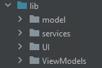
- Model contiene i <b>data dypes</b> del dominio applicativo.  
- Services contiene i manager dei <b>servizi</b> utilizzati dal client mobile.  
- UI contiene tutti i widget realizzati, ovvero le possibili <b>view</b> dell'utente.  
- ViewModels contiene tutte le <b>view model</b> dei modelli d'interesse.    
  
  
All'interno del file pubspec.yaml sono dichiarati tutti i <b>package esterni</b> utilizzati dall'App:
    
    //Firebase
    firebase_core: ^1.7.0               //Firebase Core API
    firebase_auth: ^3.1.3               //Firebase Authentication API
    firebase_database: ^8.0.0           //Firebase Realtime DB API   
    firebase_storage: ^10.0.5           //Firebase Storage API

    //Position 
    google_maps_flutter: ^2.0.11        //Google Maps Widget
    geocoding: ^2.0.1                   //Geocoding e reverse geocoding
    location: ^4.3.0                    //consente di sfuttare i location service nativi di sist

    //Images
    image_picker: ^0.8.4+2              //consente di scattare foto o di recuperarle dalla galleria

    //Network
    internet_connection_checker: ^0.0.1+3   //utilizzato per verificare la presenza o meno di connessione internet
    path_provider: ^2.0.5               //utilizzato per la gestione dei file all'interno del filesystem locale
    cached_network_image: ^3.1.0        //consente di salvare in cache locale le immagini proveniente da internet

    //Provider 
    provider: ^6.0.1                    //mette a disposizione diversi tipi di Provider
        
    //GUI
    fluttertoast: ^8.0.8                //Toast Widget
    google_fonts: ^2.1.0                //Fonts package
    settings_ui: ^1.0.0                 //User settings GUI
    transparent_image: ^2.0.0           //Transparent png usato per i Fade-in 
    flutter_spinkit: ^5.1.0             //Spinning widget for loading page
    line_icons: ^2.0.1                  //Icons package
    flutter_launcher_icons: ^0.9.2      //Icon App

I data type del dominio dell'applicazione sono:  
- AppUser, generico utente dell'applicazione contraddistinto dal suo id univoco, username ed email con cui si è autenticato.
- UserImage, foto georeferenziata caricata da un generico utente, completa di metadati quali nome del luogo e  breve descrizione.

 All'interno del package services sono presenti 3 classi:
- database_service: espone le reference e l'interfaccia CRUD delle collezioni /users /photos e /sharedImages presenti nel realtime database e nello storage. 
- auth_service: gestisce le chiamate all'endpoint di autenticazione esponendo metodi di sign-in, login, logout e cambio/recupero password.
- location_service: gestisce le chiamate al sistema per i servizi geolocalizzazione ed espone un metodo per realizzare reverse geo-coding

 Il flusso di informazioni all'interno dell'Applicazione rispetta il pattern architetturale Model-View-ViewModel, in particolare i 3 modelli di interesse sono:

- Markers: Tutte le foto georeferenziate caricate dagli utenti, renderizzate come live markers sulla mappa.  
- UserData: I dati dell'utente che sta utilizzando l'applicazione, mostrati nella main page e nelle user's settings.
- Gallery: Le foto caricate dal singolo utente renderizzate nella sua galleria personale.

Le classi presenti nel package ModelViews estendono <b>ChangeNotifier</b> e sono:

- MarkerModel: modelview di Marker, espone una lista di UserImage
- GalleryModel: modelview di Gallery, espone una lista di UserImage
- UserDataModel: modelview di UserData, espone username e e_mail dell'utente

All'interno di ognuna di queste classi troviamo una StreamSubscription ad un particolare modello presente sul database real time. Attraverso la subscription ogni volta che il modello cambia viene recuperato il suo stato aggiornato e lo si espone attraverso la callback NotifyListeners, in questo modo tutte le view collegate alla view model vengono notificate.  

Le varie <b>view</b> interessate ad un modello sono Widget <b>Consumer</b> di tale modello e ne renderizzano i dati all'interno del metodo di build. Ogni qual volta un modelview invoca il meotodo NotifyListeners tutti i widget consumer di quel modello eseguono un rebuild. 

Il linking tra view e viewmodel viene eseguito attraverso diversi <b>ChangeNotifierProviders</b>, classe presente nel package Providers.

    Esempio: MainPage() è consumer di UserDataModel e MarkerModel

    Il widget MainPage è wrappato in un ChangeNotifierProvider<MarkerModel> e in un ChangeNotifierProvider<UserDataModel> i quali istanziano e linkano alla vista rispettivamente un MarkerModel() e UserDataModel(). 
    Ad ogni cambio di stato dei modelli corrisponderà una NotifyListeners che indurrà un rebuild del widget.

        '/main_page': (context) => ChangeNotifierProvider<MarkerModel>(
              create: (_) => MarkerModel(),
              child: ChangeNotifierProvider<UserDataModel>(
                create: (_) => UserDataModel(),
                child: MainPage(),
              ),
            ),

# ModelloNavigazionale

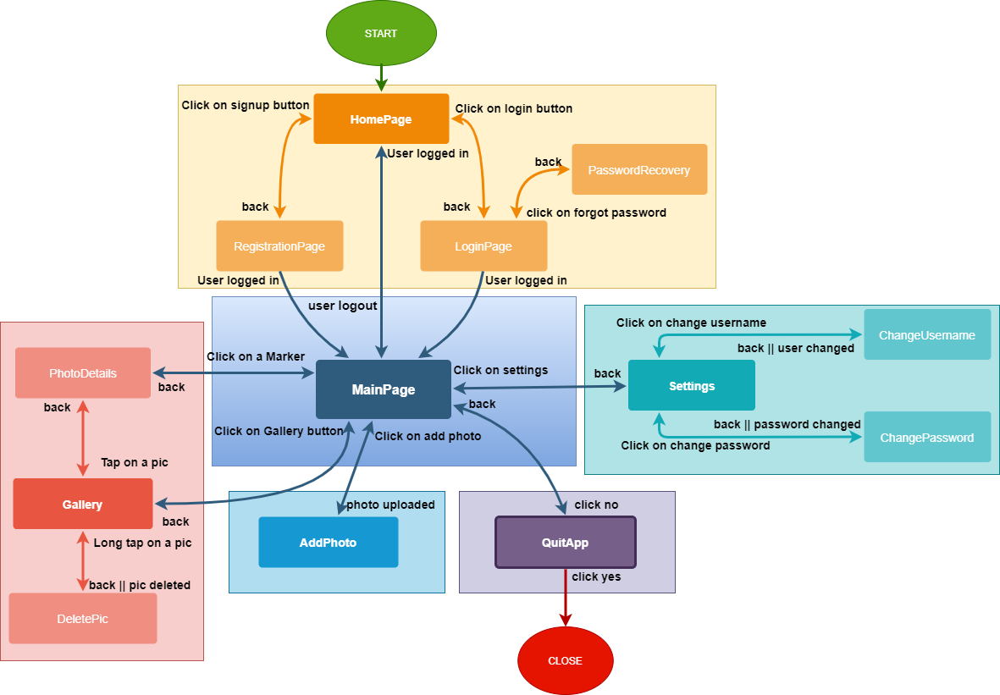  

      

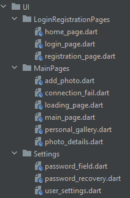
Le viste sono i widget presenti nel package <b>UI</b>:
  

- Nel package <b>LoginRegistrationPages</b> sono presenti le viste che gestiscono la registrazione e il login di un nuovo utente.
- Nel package <b>MainPages</b> sono presenti le viste che gestiscono l'upload di una nuova foto, la visione delle foto caricate nella galleria personale (con possibilità di eliminarle) e la visione su mappa dei marker relativi alle foto caricate da tutti gli utenti. Sono presenti inoltre pagine di supporto come la pagina di caricamento e la schermata che viene mostrata quando si va offline.
- Nel package <b>Settings</b> sono presenti le viste che gestiscono il cambio di username e password, il recupero della password attraverso e-mail e l'eliminazione dell'account.

        

## Home - SignUp - Login - Recover your password
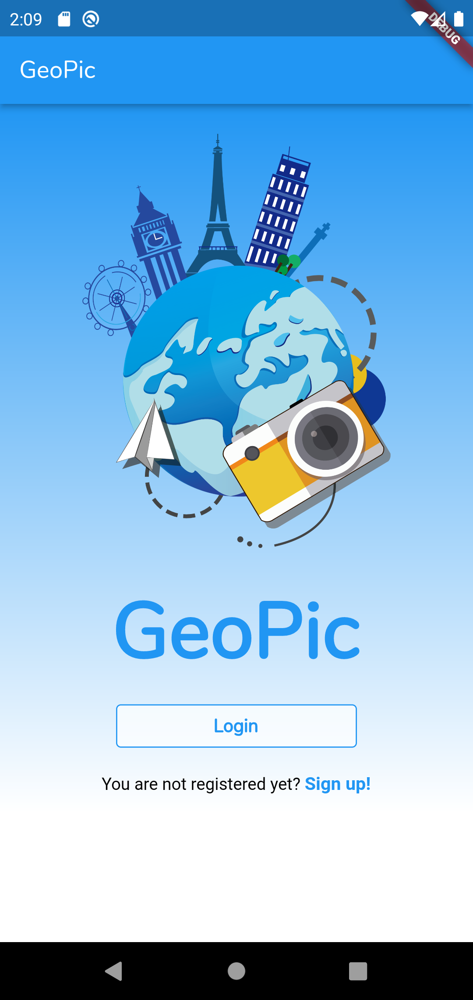
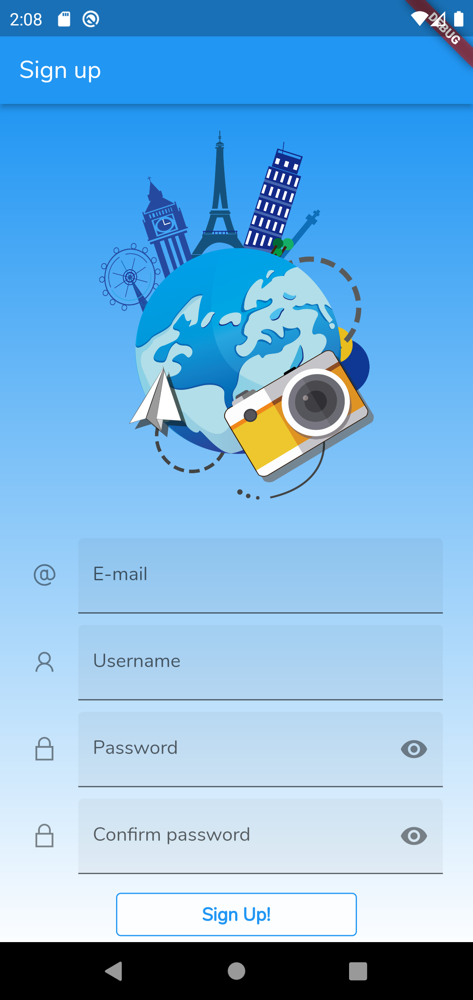
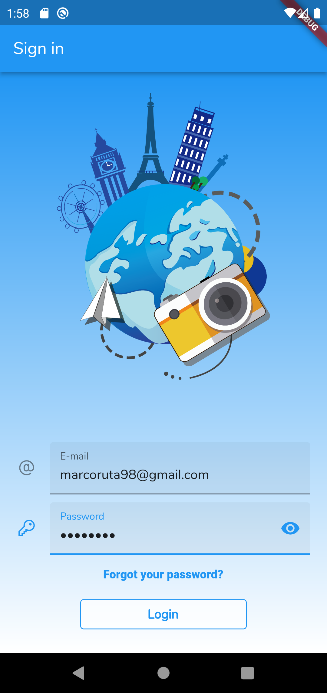
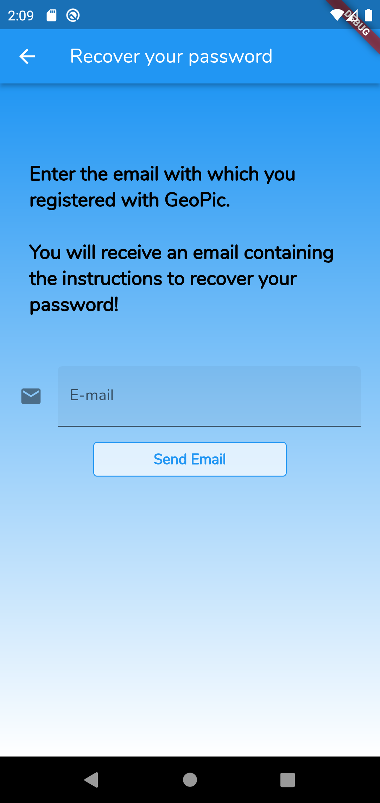

  <b>HomePage</b>: landing page, consente all'utente di scegliere se effettuare il login o registrarsi e lo direziona verso una delle due pagine.  
  <b>SignUp</b>: consente all'utente di registrarsi inserendo la sua e-mail, la password e l'username personale.  
  <b>Login</b>: consente ad un utente registrato di accedere all'applicazione oppure, cliccando forgot your password, di accedere alla sezione di recupero password.  
  <b>RecoverYourPassword</b>: consente ad un utente di recuperare la password attraverso l'email con cui si è registrato 
  

## MainPage
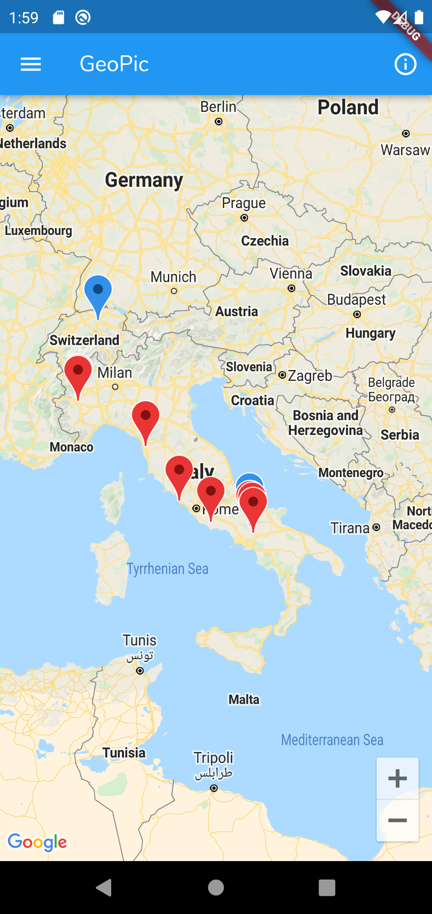
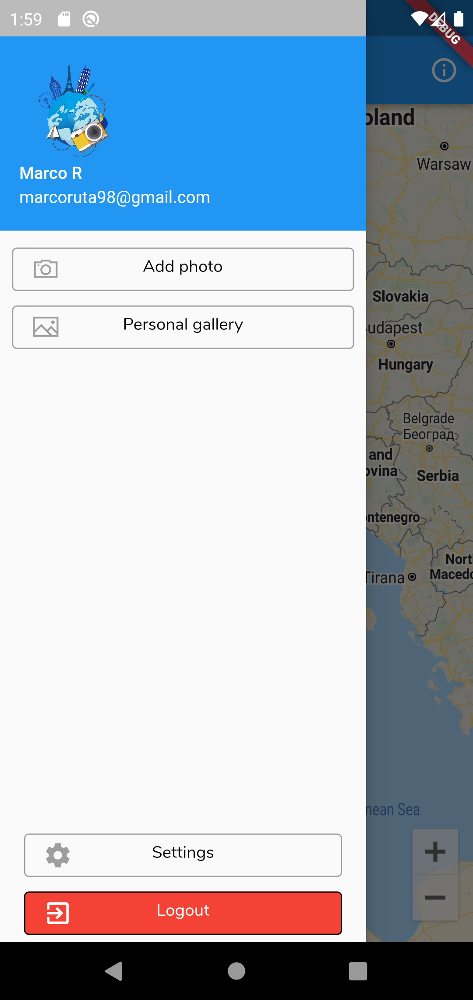
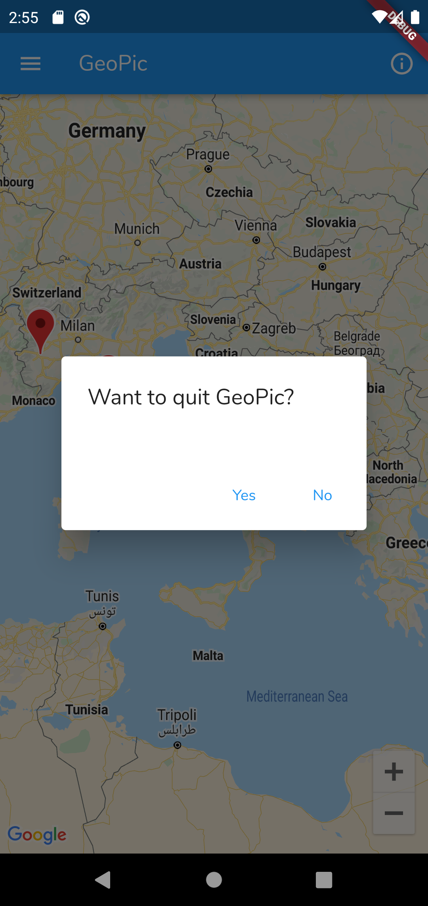  

  <b>MainPage</b>: Nella mainpage è presente una mappa dove sono visualizzati i marker relativi alle foto georeferenziate caricate da tutti gli utenti. Le foto caricate dall'utente sono rappresentate da un Marker blu, quelle degli altri utenti da un marker rosso.   Nel momento in cui l'utente clicca un marker verrà mostrato il dettaglio dell'immagine relativa a quel marker.  
   
  Nella main page è presente un <b>navigation drawer</b> con più pulsanti:
  - Add photo porta alla vista di aggiunta nuova foto georeferenziata
  - Personal gallery porta l'utente alla sua galleria personale
  - Settings che porta all'are di impostazioni dell'utente
  - Logout che riporta l'utente alla landing page

Nel caso in cui l'utente prema back mentre si trova in main page verrà mostrato un  pop-up per confermare o meno la chiusura dell'applicazione.
 

## Add a pic - Gallery - Pic Details - Delete Pic
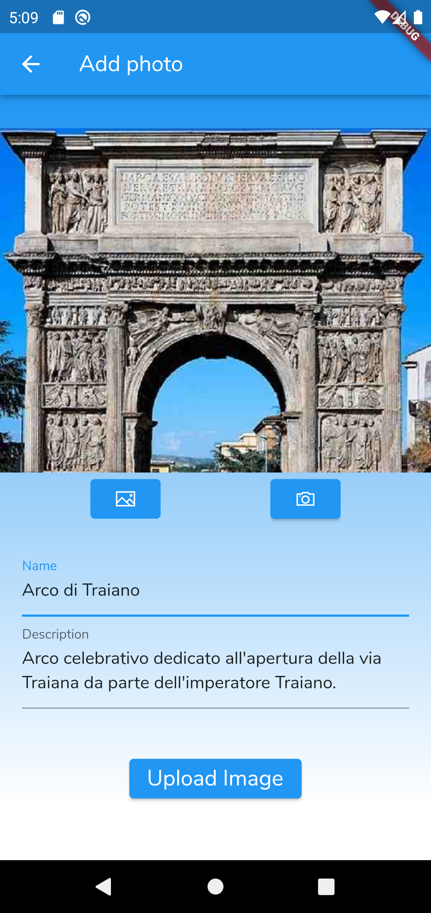
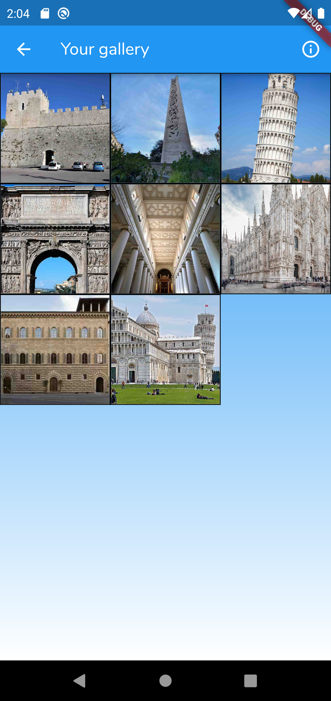
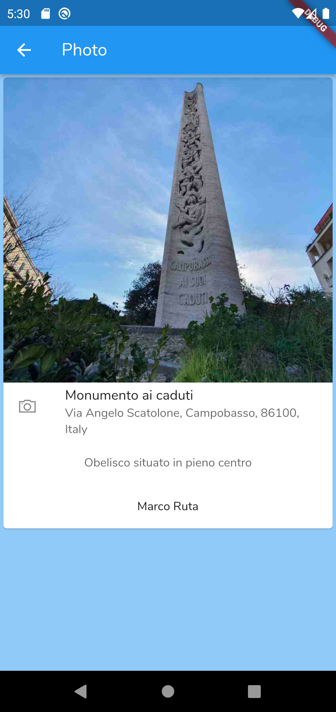  
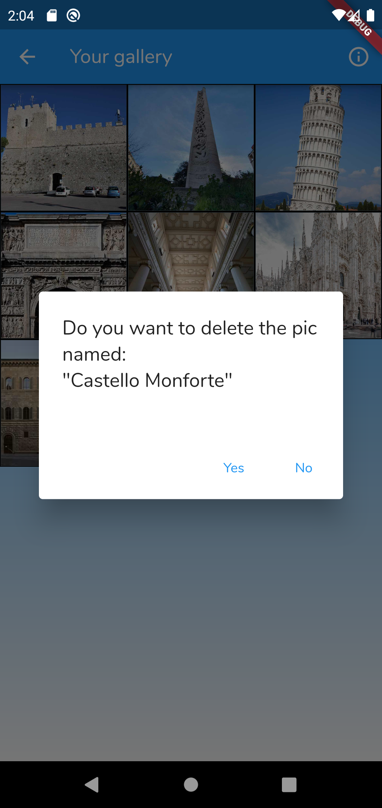 

In <b>Add Photo</b> l'utente può caricare una foto georeferenziata sulla sua posizione attuale.
  

In <b>Personal Gallery</b> l'utente può cliccare su una foto per vederene i dettagli o tenere premuto su una foto per aprire il pop-up ed eliminare una foto.

In <b>PhotoDetails</b> viene mostrata la foto con i relativi metadati.

  

## Settings
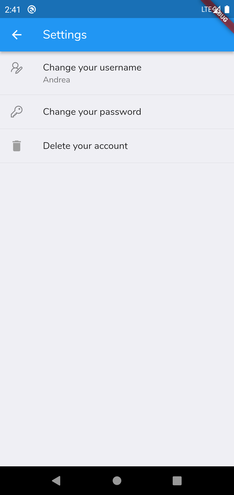
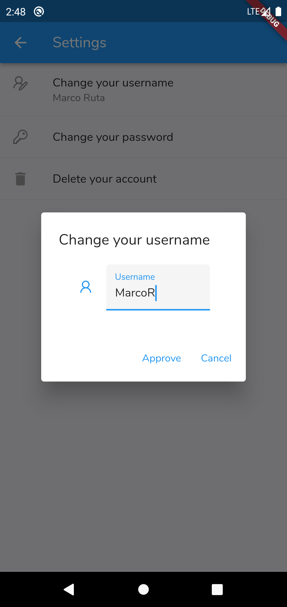
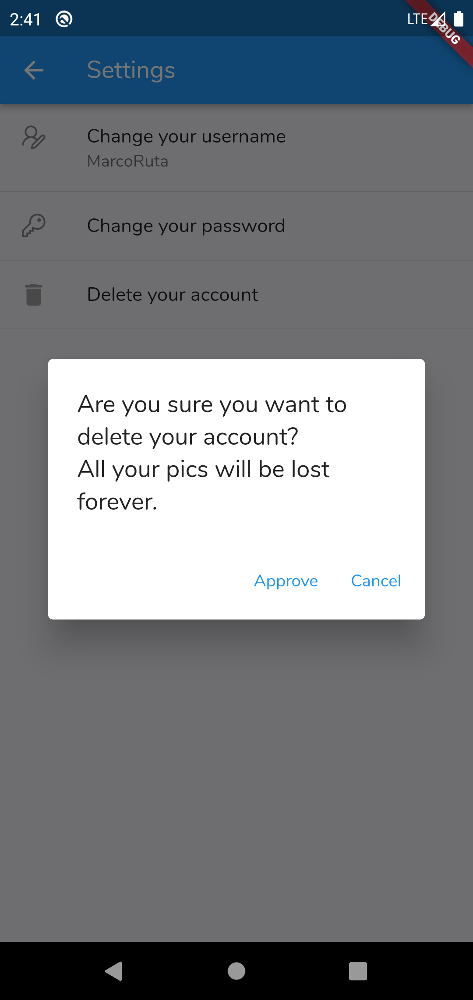
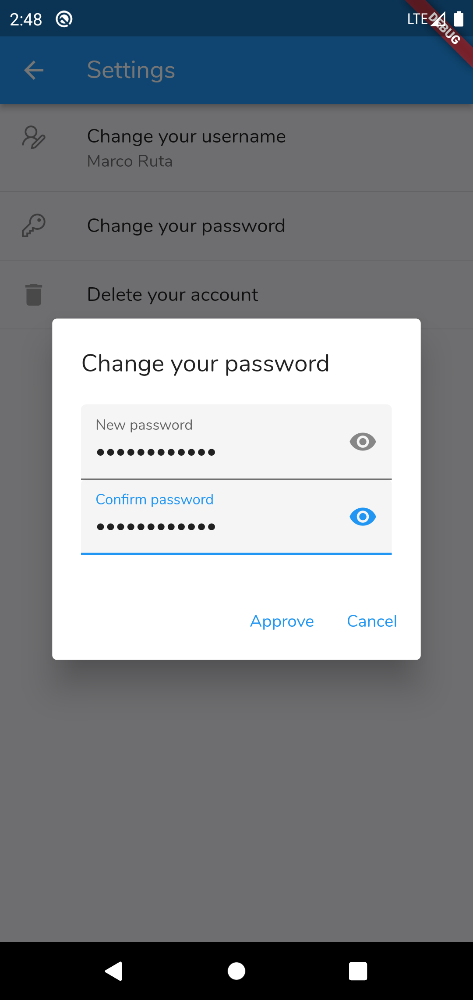  

Le impostazioni modificabili dall'utente sono due:

- Username
  
- Password

Per entrambe le impostazioni esiste un bottone che una volta cliccato apre il relativo pop-up che consente di modificare la password o l'username, il cambio della password è un'operazione sensitiva e potrebbe essere richiesto all'utente di rieseguire il log-in.

L'utente può decidere di eliminare il proprio account. In seguito a questa decisione verranno eliminati tutti i dati delle foto caricate dall'utente ed i suoi dati personali.
  

## Support views
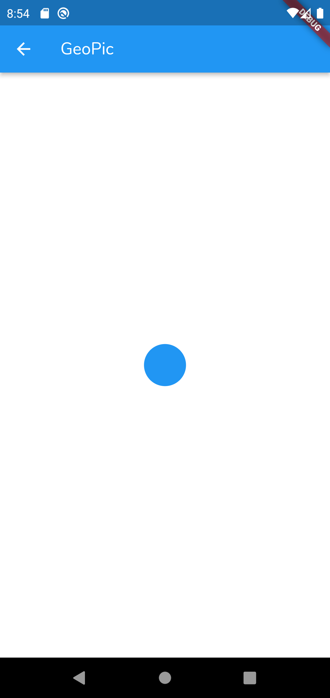
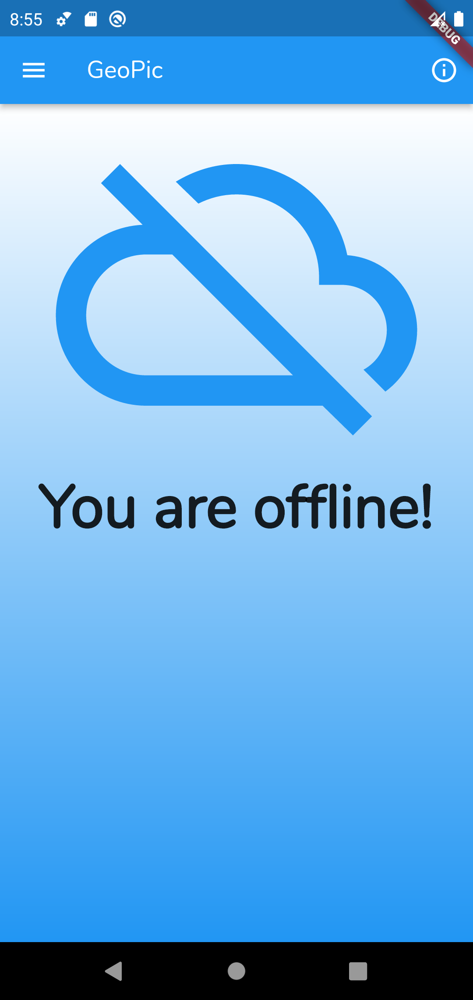

Queste viste sono di supporto e vengono mostrate in due casi:

- LoadingPage viene mostrata durante l'esecuzione di operazioni non immediate come l'upload di una foto.
- ConnectionFail viene mostrata se il dispositivo viene disconnesso dalla rete ed impedisce all'utente di utilizzare l'applicazione.
  

# Servizi

- <b>Storage dispositivo</b>: l'intera applicazione utilizza dati provenienti da RealTime DB o Storage by Firebase senza persistenza nello storage del dispositivo.  
Lo storage locale viene utilizzato solo per salvare in cache:

  - Il Token di autenticazione e l'user Id recuperati attraverso login, il salvataggio viene gestito in modo trasparente dall'SDK di autenticazione.
  - Le immagini visualizate dall'utente vengono salvate in cache durante l'utilizzo dell'applicazione e fino alla sua chiusura. 
    

- <b>Fotocamera e Galleria del dispositivo</b>: la fotocamera viene utilizzata attraverso il package <b>image_picker</b>, all'interno del package sono specificati due metodi che consentono di recuperare un'immagine dalla galleria o scattandola con la fotocamera.   Dalla versione 0.8.1 in poi questo package utilizza Scoped Storage e non è necessario specificare i permessi nel Manifest per utilizzare la galleria.

- <b>Posizione</b>: la geolocalizzazione viene gestita attraverso il package <b>location</b>, l'accesso alla posizione dell'utente viene richiesto solo nel momento in cui si carica una foto.  L'utilizzo di tale package richiede l'abilitazione dei servizi di locazione di android attraverso il Manifest.

- <b>Rete</b>: il funzionamento dell'applicazione è del tutto dipendente dalla presenza di connessione.   Attraverso il package <b>internet connection checker</b> viene monitorato lo stato della connessione durante tutto il ciclo di vita dell'applicazione. Per valutare la presenza o meno di connessione vengono eseguiti dei ping test su degli indirizzi noti, in modo da valutare correttamente la presenza o meno di rete.
L'intera MaterialApp è wrappata in un Provider di ConnectionStatusStream, in modo che tutti i widget possano valutare la presenza o meno della connessione.
